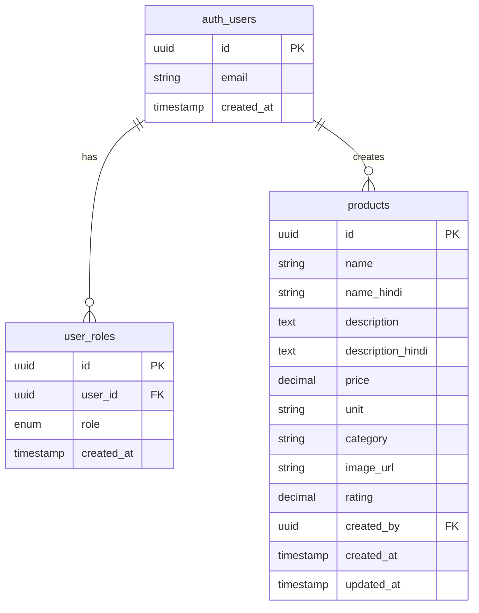
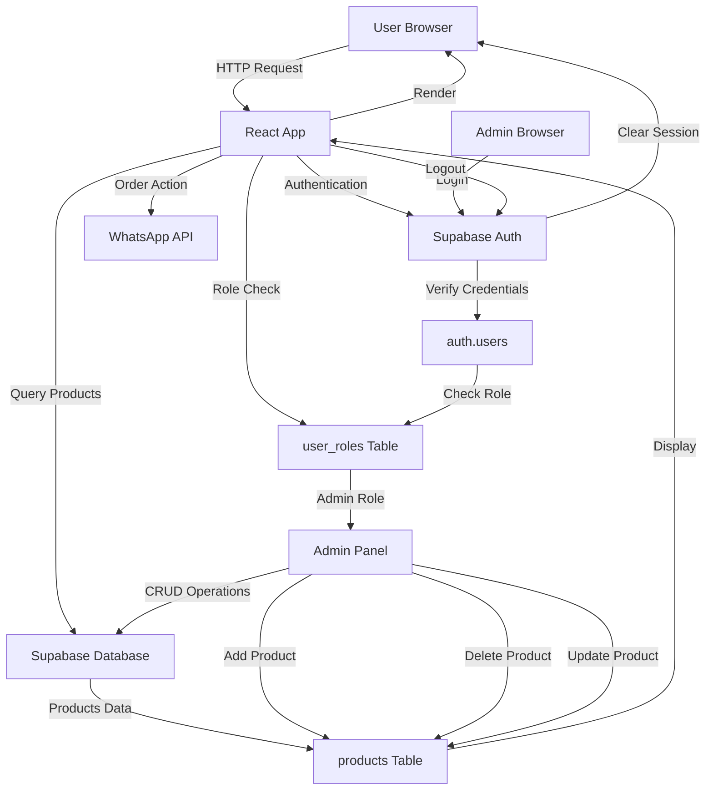
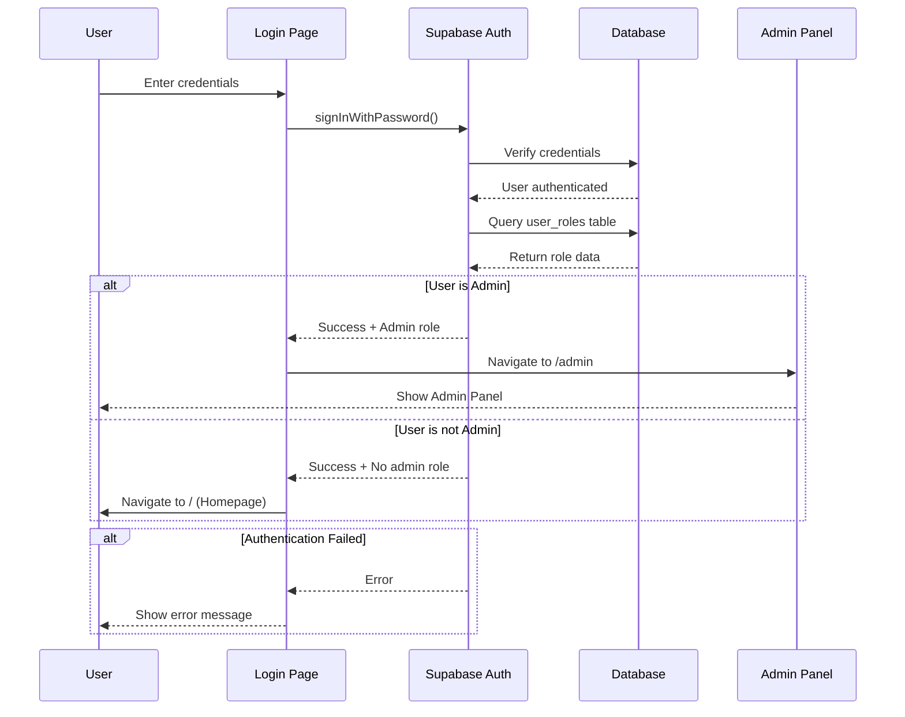

# KBC Agricultural Products Website

A full-stack e-commerce platform for agricultural products with admin panel, built with React, TypeScript, and Lovable Cloud (Supabase).

**Project URL**: https://lovable.dev/projects/88a93a4f-fe63-492e-969a-0fba32b939e7

## 🌟 Features

- **Product Catalog**: Browse agricultural products with detailed information in English and Hindi
- **Order via WhatsApp**: Direct ordering through WhatsApp integration
- **Admin Panel**: Secure admin interface for product management
- **Responsive Design**: Mobile-friendly interface with beautiful UI
- **Multi-language Support**: Product information in both English and Hindi
- **Image Gallery**: Product images with farming banners
- **Contact Form**: Direct communication with the business
- **Dealer Locator**: Find nearest dealers
- **Dosage Calculator**: Calculate product dosage for crops

## 🛠️ Tech Stack

### Frontend
- **React 18** - UI library
- **TypeScript** - Type safety
- **Vite** - Build tool
- **React Router** - Navigation
- **TailwindCSS** - Styling
- **Shadcn/ui** - Component library
- **Lucide React** - Icons
- **Sonner** - Toast notifications

### Backend (Lovable Cloud/Supabase)
- **Authentication** - User management with email/password
- **PostgreSQL** - Database
- **Row Level Security (RLS)** - Data protection
- **Storage** - File uploads

## 📁 Project Structure

```
kbc-agricultural/
├── src/
│   ├── components/
│   │   ├── ui/                    # Shadcn UI components
│   │   ├── BannerSlider.tsx       # Homepage banner carousel
│   │   ├── Footer.tsx             # Site footer
│   │   ├── Header.tsx             # Navigation header
│   │   ├── ProtectedRoute.tsx     # Admin route guard
│   │   ├── VideoGallery.tsx       # Video content display
│   │   └── VideoPlayer.tsx        # Video playback
│   ├── hooks/
│   │   ├── useAdmin.tsx           # Admin status check hook
│   │   ├── use-mobile.tsx         # Mobile detection
│   │   └── use-toast.ts           # Toast notifications
│   ├── integrations/
│   │   └── supabase/
│   │       ├── client.ts          # Supabase client (auto-generated)
│   │       └── types.ts           # Database types (auto-generated)
│   ├── pages/
│   │   ├── Index.tsx              # Homepage with featured products
│   │   ├── Products.tsx           # Complete product catalog
│   │   ├── Contact.tsx            # Contact form
│   │   ├── DealerLocator.tsx      # Dealer locations
│   │   ├── DosageCalculator.tsx   # Dosage calculator tool
│   │   ├── Login.tsx              # Admin login/signup
│   │   ├── Admin.tsx              # Admin dashboard
│   │   └── NotFound.tsx           # 404 page
│   ├── assets/                    # Images and static files
│   ├── App.tsx                    # Root component with routes
│   ├── main.tsx                   # Application entry point
│   └── index.css                  # Global styles
├── supabase/
│   ├── config.toml                # Supabase configuration
│   └── migrations/                # Database migrations
└── public/
    ├── robots.txt                 # SEO robots file
    └── favicon.ico                # Site icon
```

## 🗄️ Database Schema (ER Diagram)



### Tables

#### `auth.users` (Managed by Supabase Auth)
- Stores user authentication data
- Automatically managed by Supabase

#### `user_roles`
- Links users to roles (admin, user, etc.)
- Enables role-based access control
- Protected by RLS policies

#### `products`
- Stores all agricultural product information
- Bilingual content (English and Hindi)
- Includes pricing, category, and ratings
- Protected by RLS policies (only admins can modify)

## 🔄 Data Flow Diagram



## 🔐 Authentication Flow



## 🚀 How It Works

### For Customers (Public Users)

1. **Browse Products**
   - Visit homepage or products page
   - View product details in English/Hindi
   - See pricing and ratings

2. **Place Order**
   - Click "Order Now" button
   - Redirected to WhatsApp with pre-filled message
   - Complete order via WhatsApp chat

3. **Use Tools**
   - Contact form for inquiries
   - Dealer locator to find nearby dealers
   - Dosage calculator for crop recommendations

### For Admins

1. **Login**
   - Navigate to `/login`
   - Enter admin credentials
   - Automatically redirected to `/admin` panel

2. **Manage Products**
   - Add new products with details
   - Upload product images
   - Set pricing and categories
   - Delete outdated products

3. **Logout**
   - Click logout button in admin panel
   - Session cleared, redirected to homepage

## 🔒 Security Features

### Row Level Security (RLS)
- **Products Table**: 
  - Public can read (SELECT)
  - Only admins can create/update/delete
  
- **User Roles Table**:
  - Only accessible via secure functions
  - Prevents privilege escalation

### Authentication
- Email/password authentication via Supabase
- Secure session management
- Protected admin routes
- Auto-confirm email for development

### Route Protection
- `/admin` route protected by `ProtectedRoute` component
- Checks both authentication and admin role
- Automatic redirect for unauthorized access

## 📱 Features Breakdown

### Homepage (`/`)
- Hero banner slider with farming images
- Featured products showcase
- Quick navigation to all sections
- Responsive grid layout

### Products Page (`/products`)
- Complete product catalog
- Category filtering
- Bilingual product information
- Direct WhatsApp ordering
- Product images and ratings

### Admin Panel (`/admin`)
- Product management dashboard
- Add product form with validations
- Product list with images
- Delete functionality
- Logout button (top-right corner)

### Contact Page (`/contact`)
- Contact form
- Business information
- Location details

### Dealer Locator (`/dealer-locator`)
- Find nearby dealers
- Location-based search

### Dosage Calculator (`/dosage-calculator`)
- Calculate product dosage
- Crop-specific recommendations

## 🎨 Design System

The project uses a semantic token-based design system defined in:
- `src/index.css` - CSS custom properties (colors, spacing, etc.)
- `tailwind.config.ts` - Tailwind configuration
- Components use design tokens instead of hardcoded colors

## 🌐 Environment Variables

```
VITE_SUPABASE_URL=<auto-configured>
VITE_SUPABASE_PUBLISHABLE_KEY=<auto-configured>
VITE_SUPABASE_PROJECT_ID=<auto-configured>
```

These are automatically configured by Lovable Cloud.

## 📦 Dependencies

### Core
- React 18.3.1
- React Router DOM 6.30.1
- TypeScript
- Vite

### UI & Styling
- TailwindCSS
- Shadcn/ui (Radix UI components)
- Lucide React (icons)
- class-variance-authority

### Backend
- @supabase/supabase-js 2.76.1
- @tanstack/react-query 5.83.0

### Forms & Validation
- react-hook-form
- zod

### Notifications
- sonner

## 🚦 Getting Started

### Local Development

Follow these steps to run the project locally:

```sh
# Step 1: Clone the repository
git clone <YOUR_GIT_URL>

# Step 2: Navigate to the project directory
cd <YOUR_PROJECT_NAME>

# Step 3: Install dependencies
npm i

# Step 4: Start the development server
npm run dev
```

### Admin Setup

1. **Create Admin User**
   - Sign up through `/login` page
   - Add admin role to user in database:
   ```sql
   INSERT INTO user_roles (user_id, role) 
   VALUES ('<user-id>', 'admin');
   ```

2. **Access Admin Panel**
   - Login with admin credentials
   - Automatically redirected to `/admin`

### Deployment

Simply open [Lovable](https://lovable.dev/projects/88a93a4f-fe63-492e-969a-0fba32b939e7) and click on **Share → Publish**.

### Custom Domain

To connect a custom domain:
1. Navigate to Project > Settings > Domains
2. Click "Connect Domain"
3. Follow the setup instructions

Read more: [Setting up a custom domain](https://docs.lovable.dev/tips-tricks/custom-domain#step-by-step-guide)

## 📈 Future Enhancements

- Shopping cart functionality
- Order history tracking
- Payment gateway integration
- Inventory management
- Customer accounts
- Product reviews and ratings
- Advanced search and filters
- Email notifications
- SMS alerts for orders

## 💡 Development Guidelines

### Editing the Code

**Via Lovable** (Recommended)
- Visit the [Lovable Project](https://lovable.dev/projects/88a93a4f-fe63-492e-969a-0fba32b939e7)
- Start prompting for changes
- Changes automatically committed to repo

**Via IDE**
- Clone the repo and push changes
- Pushed changes reflected in Lovable
- Requires Node.js & npm

**Via GitHub**
- Edit files directly in GitHub
- Or use GitHub Codespaces

### Important Files (Do Not Edit)
- `src/integrations/supabase/client.ts` - Auto-generated
- `src/integrations/supabase/types.ts` - Auto-generated
- `.env` - Auto-configured

## 🤝 Support

For questions or issues:
- WhatsApp: +91 9039145050
- Through contact form on website

## 📄 License

Proprietary - KBC Agricultural Products

---

Built with ❤️ using Lovable and Supabase
